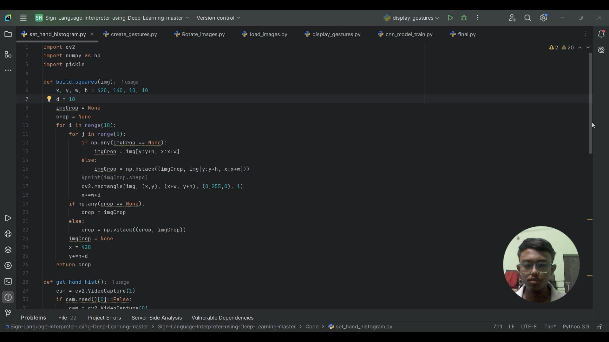
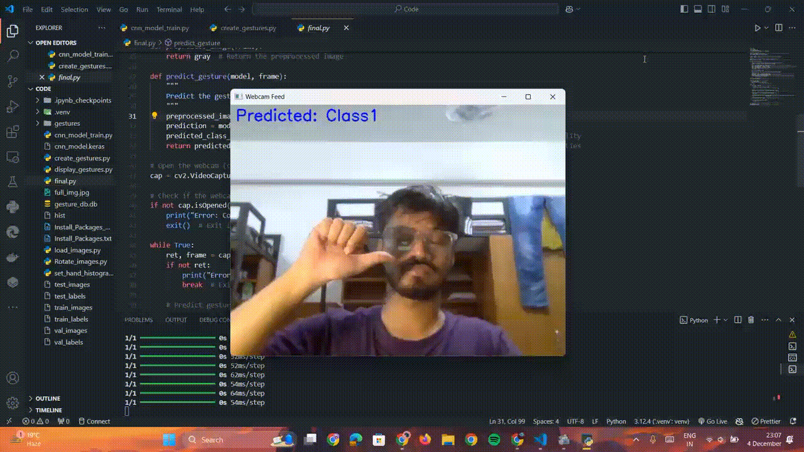
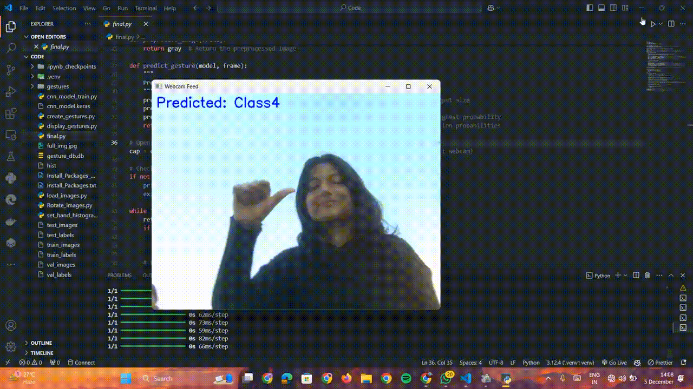
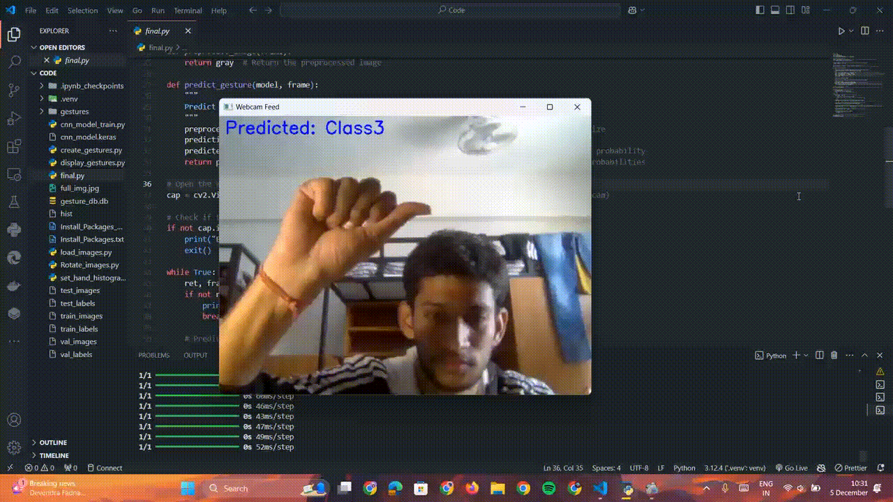
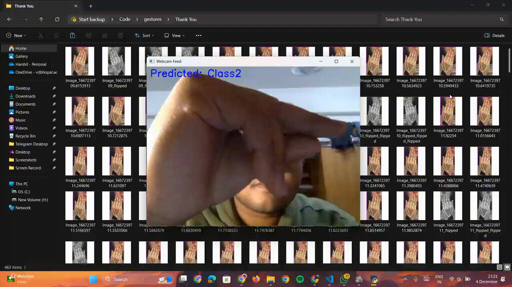
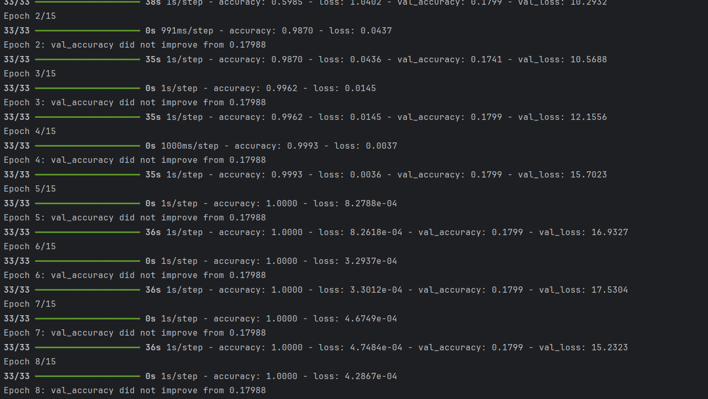

# Sign Language Interpreter using Deep Learning
> A sign language interpreter using live video feed from the camera. 

## Table of contents
* [General info](#general-info)
* [Demo](#demo)
* [Output](#output)
* [Screenshots](#screenshots)
* [Technologies and Tools](#technologies-and-tools)
* [Setup](#setup)
* [Process](#process)
* [Features](#features)

## General info

This project is a capstone initiative developed by Group 30, focused on leveraging technology to bridge communication gaps. The aim is to create an innovative solution that empowers individuals with hearing disabilities to communicate effectively and independently. By combining advanced techniques in artificial intelligence and real-time processing, the application serves as a personal translator, fostering inclusivity and enhancing accessibility for millions of people worldwide.

## Demo

### Watch the full code here by clicking the image below:

## Output

## Screenshots

## Technologies and Tools
* Python 
* TensorFlow
* Keras
* OpenCV

## Setup

* Use comand promt to setup environment by using install_packages.txt and install_packages_gpu.txt files. 
 
`pyton -m pip r install_packages.txt`

This will help you in installing all the libraries required for the project.

## Process

* Run `set_hand_histogram.py` to set the hand histogram for creating gestures. 
* Once you get a good histogram, save it in the code folder, or you can use the histogram created by us that can be found [here](https://github.com/Shantanu2003/Capstone-Project---Group-30/tree/master/Code/hist).
* Add different variations to the captured gestures by flipping all the images by using `Rotate_images.py`.
* Run `load_images.py` to split all the captured gestures into training, validation and test set. 
* To view all the gestures, run `display_gestures.py` .
* Train the model using Keras by running `cnn_model_train.py`.
* Run `final.py`. This will open up the gesture recognition window which will use your webcam to interpret the trained American Sign Language gestures.  

## Features
Our model was able to predict the 6 classes of gestures with a prediction accuracy of over 98%.

Features that can be added:
* Deploy the project on cloud and create an API for using it.
* Increase the vocabulary of our model
* Incorporate feedback mechanism to make the model more robust
* Add more sign languages

